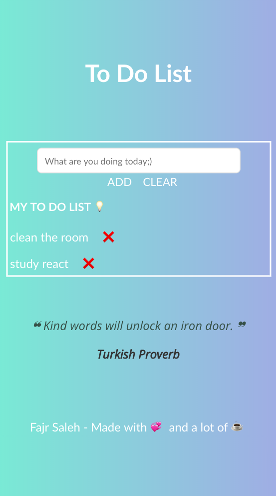

# **To Do List**

**Demo Link :** https://fajrsaleh1.github.io/

# **How To Use it ?**
It is simple **To-Do-List** website, the user can add, delete a specific task or delete all the tasks

# **Favourite Part**
Using Bootstrap makes the design process much easier and fun

# **Diffficult Part**
 Make the website responsive and dealing with React

# **Unsolved problems**
The local storage is a major issue to me, it save the data but it wont display the data on the screen.  

# **Future Ideas**
1- Add a sticky notes API, to make the user add notes not only to do list.
2- Make a category for each task for example, home and work.

# **Acknowledgements**
- Badriah
- Alya
